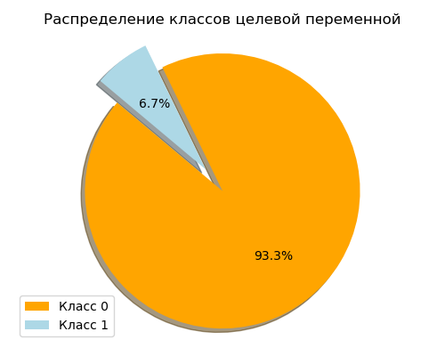
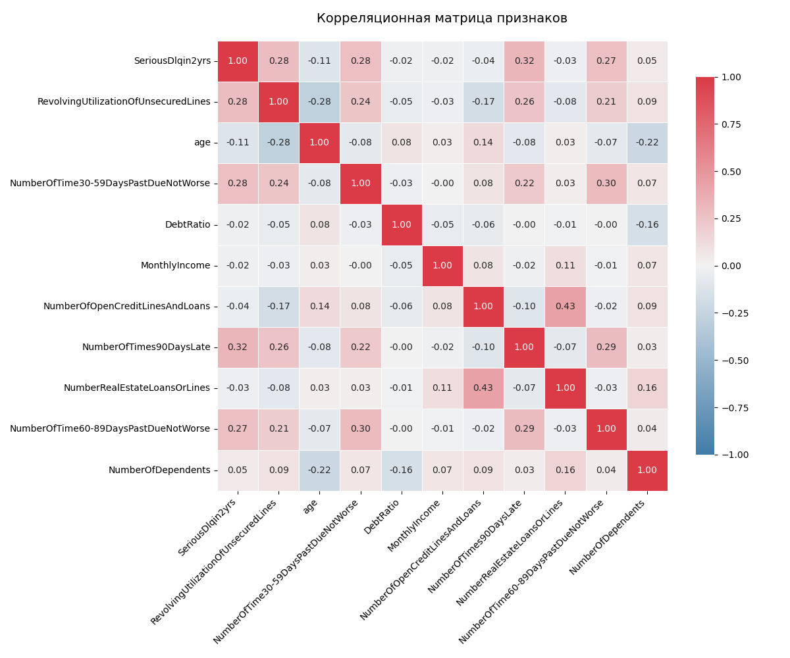
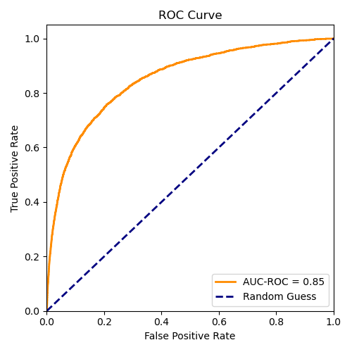
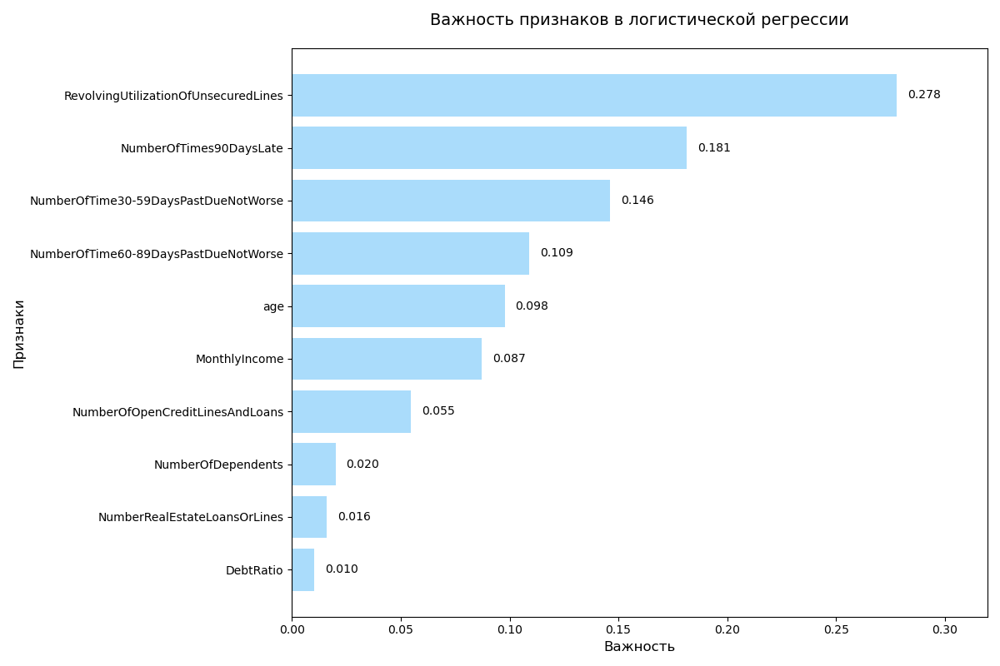
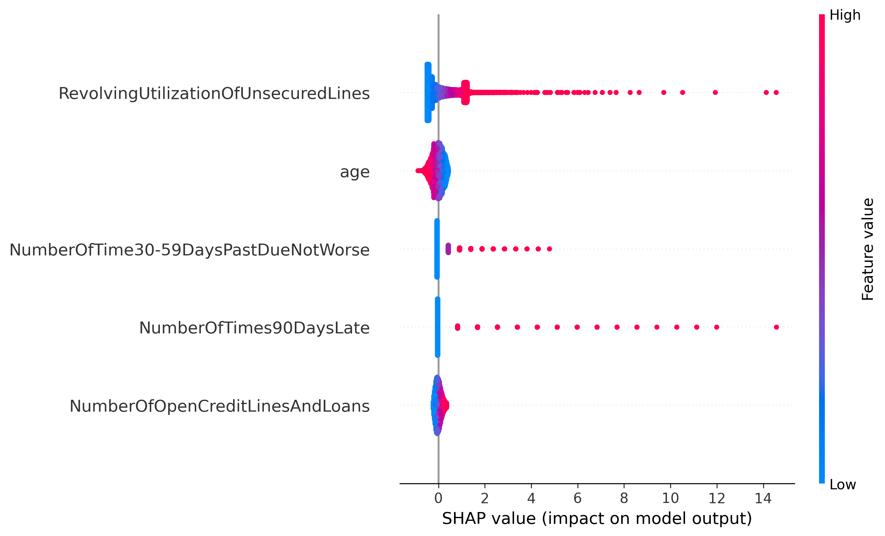

# Give_Me_Some_Credit

Описание:
Для решения задачи Give Me Some Credit с Kaggle были обучены различные модели: логистическая регрессия, XGBoost, CatBoost. Также для интерпретации работы модели были выделены топ-5 признаков, влияющих на прогноз и проведена оценка fairness модели

Обзор задачи:
Необходимо решить задачу классификации заемщиков, целевая переменная - SeriousDlqin2yrs - лицо имело просроченную задолженность на 90 дней или более.
В датасете представлены различные характеристики заемщиков:
- RevolvingUtilizationOfUnsecuredLines. Общий баланс по кредитным картам и личным кредитным линиям, за исключением недвижимости и задолженности без рассрочки, например, автокредитов, деленный на сумму кредитных лимитов
- age. Возраст заемщика в годах
- NumberOfTime30-59DaysPastDueNotWorse. Количество раз, когда заемщик просрочил платеж на 30–59 дней, но не больше за последние 2 года.
- DebtRatio. Ежемесячные выплаты по долгам, алименты, расходы на проживание, деленные на ежемесячный валовой доход
- MonthlyIncome. Ежемесячный доход
- NumberOfOpenCreditLinesAndLoans.Количество открытых кредитов (рассрочка, например, автокредит или ипотека) и кредитные линии (например, кредитные карты)
- NumberOfTimes90DaysLate. Количество раз, когда заемщик просрочил платеж на 90 дней или более.
- NumberRealEstateLoansOrLines. Количество ипотечных кредитов и кредитов на недвижимость, включая кредитные линии под залог жилья
- NumberOfTime60-89DaysPastDueNotWorse. Количество раз, когда заемщик просрочил платеж на 60–89 дней, но не больше за последние 2 года.
- NumberOfDependents. Количество иждивенцев в семье, за исключением себя (супруг(а), дети и т. д.)

В датасете наблюдается большой дисбаланс классов по целевой переменной:

Для оценки мультиколлинеарности признаков была построена матрица корреляции:

В качестве моделей были испробованы различные подходы: логистическая регресиия, XGBoost, CatBoost. Каждая из этих моделей дала схожие значения ROC-AUC~0.85. Однако логистическая регрессия с весами {0:1, 1:5} показала лучший precision из всех моделей (0.39), F1-score(0.43). Таким образом, логистическая регрессия лучше всех моделей справилась с проблемой дисбаланса классов.

ROC-кривая получившейся модели логистической регрессии:

Оценка важности признаков модели логистической регрессии:

Также для модели логистической регрессии была проведена интерпретация и оценка fairness модели (на дискриминацию по тому или иному признаку).

Топ-5 важных признаков, влияющих на прогноз, были отобраны с помощью SHAP:

