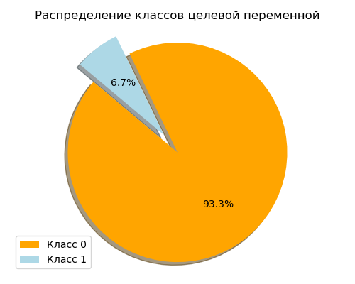
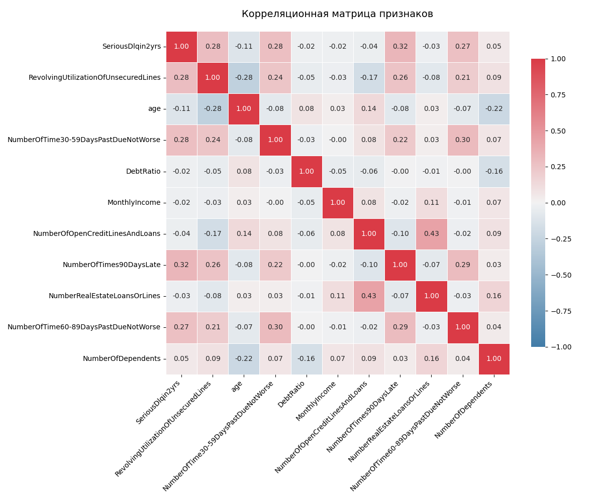
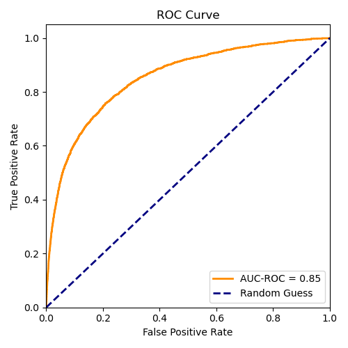
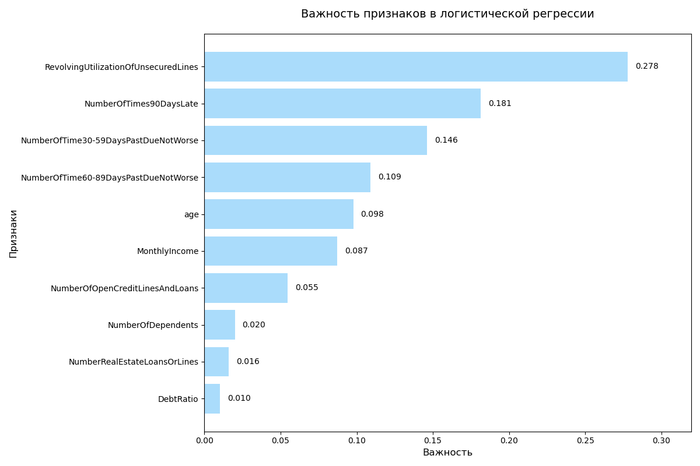
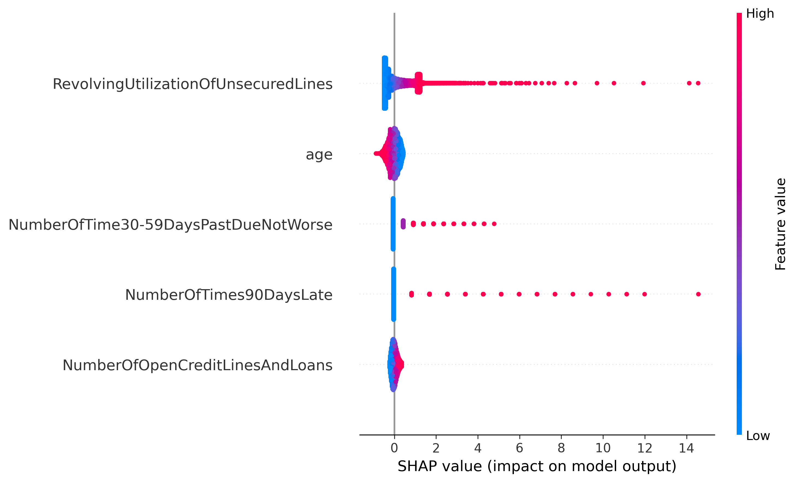

# Give_Me_Some_Credit

## Description

To solve the Give Me Some Credit task from Kaggle, various models were trained: logistic regression, XGBoost, CatBoost. Also, to interpret the model's performance, the top-5 features influencing the prediction were identified and the model's fairness was evaluated.

## Task Overview

It is necessary to solve the task of classifying borrowers, the target variable is SeriousDlqin2yrs - the person had a delinquent debt of 90 days or more.
The dataset contains various borrower characteristics:

* **RevolvingUtilizationOfUnsecuredLines**. Total balance on credit cards and personal lines of credit, excluding real estate and installment debt such as auto loans, divided by the sum of credit limits
* **age**. Borrower's age in years
* **NumberOfTime30-59DaysPastDueNotWorse**. Number of times the borrower has been 30–59 days past due, but no worse, in the last 2 years.
* **DebtRatio**. Monthly debt payments, alimony, living expenses, divided by monthly gross income
* **MonthlyIncome**. Monthly income
* **NumberOfOpenCreditLinesAndLoans**. Number of open loans (installment loans, such as auto loans or mortgages) and credit lines (such as credit cards)
* **NumberOfTimes90DaysLate**. Number of times the borrower has been 90 days or more past due.
* **NumberRealEstateLoansOrLines**. Number of mortgage and real estate loans, including home equity lines of credit
* **NumberOfTime60-89DaysPastDueNotWorse**. Number of times the borrower has been 60–89 days past due, but no worse, in the last 2 years.
* **NumberOfDependents**. Number of dependents in the family, excluding themselves (spouse, children, etc.)

### **There is a large class imbalance in the target variable in the dataset:**

### **A correlation matrix was constructed to assess feature multicollinearity:**

## Model Building

Various approaches were tried as models: logistic regression, XGBoost, CatBoost. Each of these models showed similar ROC-AUC values of ~0.85. However, logistic regression with weights {0:1, 1:5} showed the best precision of all models (0.39), F1-score (0.43). Thus, logistic regression handled the class imbalance problem better than all other models.

### **ROC curve of the resulting logistic regression model:**

### **Feature importance assessment of the logistic regression model:**

## Model Interpretation

The logistic regression model was also interpreted and its fairness was evaluated (for discrimination based on a particular feature).

### **The top-5 important features influencing the prediction were selected using SHAP:**

